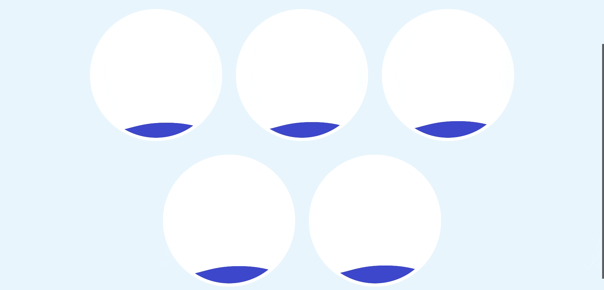
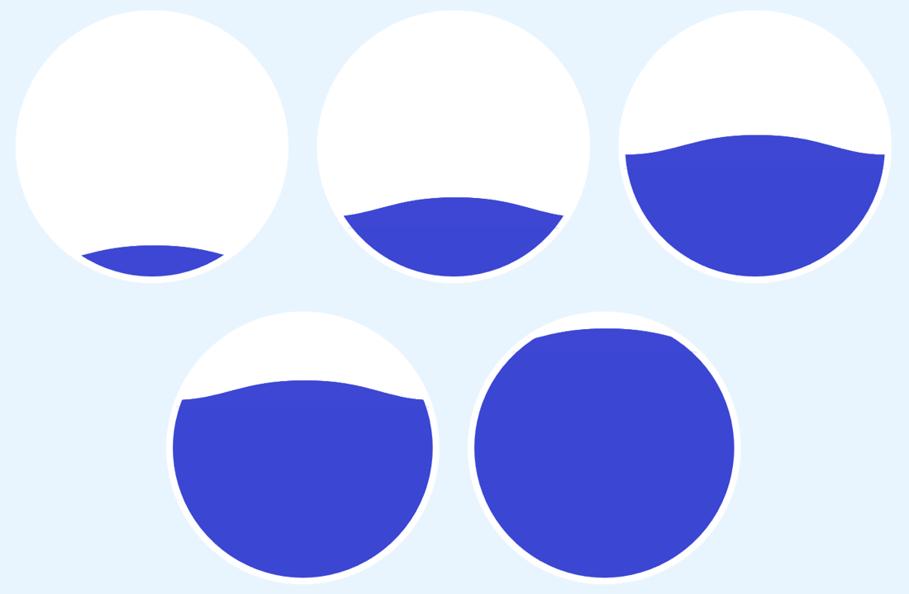
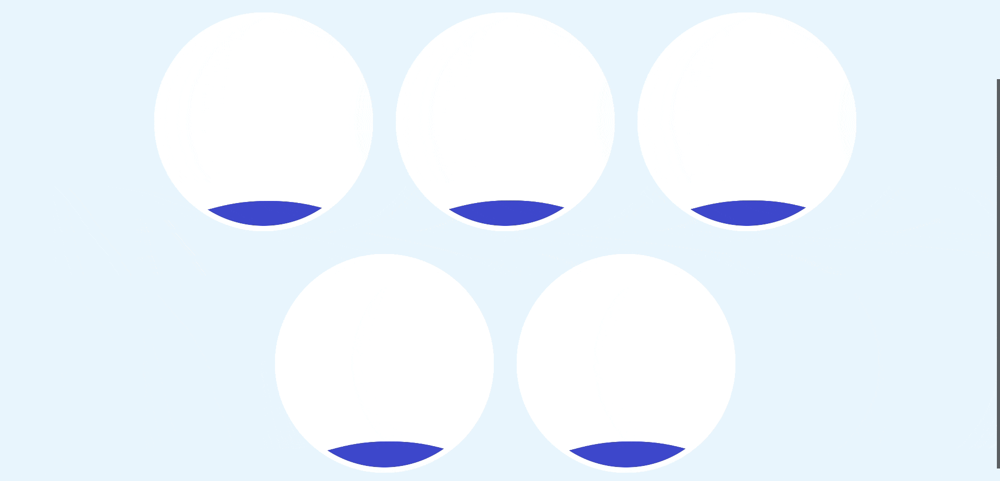

# CSS Water Wave Filling Animation

Fill wavy water in circle with pure css code. Use as circular percentage chart, loading, and more.

**DEMO:** https://coiger.github.io/fill-water-animation  
**CODEPEN:** https://codepen.io/coiger/pen/NWYgxgj



## Positioning

```html
<div class="circle-container">
  <div class="circle"></div>
  <div class="wave _0"></div>
  <div class="wave _0"></div>
  <div class="wave _0"></div>
  <div class="wave-below _0"></div>
  <div class="desc _0">
    <h2>Today</h2>
    <p>
      <b>0<span>%</span></b>
    </p>
  </div>
</div>
```

The code above shows the elements that make up a circle filled with waving water. The meaning of each class is as follows.

- `.circle`: background circle
- `.wave`: waves
- `.wave-below`: water filled under the wave
- `.desc`: description
- `._0`: a class to give different styles depending on the degree of filling with water (e.g., `_25`, `_50`, `_75`, `_100`)

As you will see later, `wave` class will receive an animation with an wave background image in svg format. For `wave-below` class's animations, `clip-path` property will be used.

Coming back to positioning, all child elements inside the `circle-container` class are stacked one after another by giving `absolute` display. The css code below shows this.

```css
.circle-container {
  position: relative;
}

.circle-container > * {
  position: absolute;
  top: -10px;
  left: -10px;
  width: 100%;
  height: 100%;
  border-radius: 50%;
  border: 10px solid white;
}
```
Because of `box-sizing: content-box`, `width: 100%`, and `border-width: 10px`, the child elements of `circle-container` class becomes 20px larger than the parent element. Therefore, the `top` and `left` properties are given -10px each so that the child elements are positioned in the center of the parent element. (Alternatively, it can be solved by, for example, setting `box-sizing: border-box`.)

## Make Waves

```css
.wave {
  background: url(wave.svg) repeat-x;
  opacity: 0.8;
}

.wave-below {
  background-color: #3b46d3;
}
```

The code above styles the waves and the water below them. The waves were given `opacity`, so visual effects will be increased as the waves overlap. `#3b46d3` is the main color of this project, and the svg file is also filled with this color. You can check it in the `fill` attribute of the `path` tag in svg file.

The reason for separating the wave and the water below, is to make the water and the wave regardless of the size of the circle container. I thought that if whole was composed of one image, it might not be suitable to fill the tall elements. I wanted the waves to be the same size and shape.

The downside is that each of these two elements is animated, so fine-tuning is necessary to avoid ugly animations due to gap between the wave and the water.

```css
.wave._0 {
  background-position: 0% 110%;
}
.wave-below._0 {
  clip-path: polygon(0% 110%, 0% 110%, 110% 110%, 110% 110%);
}

.wave._25 {
  background-position: 0% 87%;
}
.wave-below._25 {
  clip-path: polygon(0% 110%, 0% 80%, 110% 80%, 110% 110%);
}
```

The code above is part of the code to place a wave and water below it. For the rest of the code, refer to `style.css`.

The property used to place the waves is the `background-position`, and the water below uses the `clip-path` to show only the part of background.

Here's what it looks like so far:



Class `_0` means that water is 0% filled, and `_25` means that it is 25% full. However, _note that the percentage value seems somewhat less relevant_. This means that I didn't fill the water exactly, say 25% correctly, and in some circumstances you don't have to. Such a situation is, for example, when using quantized values such as 0%, 25%, 50%, 75%, 100% as in this project. I thought it's enough to give proper distinction between those values. So, the value in codes can be flexibly changed if you want, but you may need to adjust the values of animation properties.

Conversely, that's why this code may not be suitable if you use more fine-grained values. You can, but I expect it to be difficult to fine-tune the animation. If you want to, take a look at the code to see what percentage values are changed to represent different fills. You may need to adjust the related animation properties, and I will explain the trial and error I went through while adding animation.

## Define Animations

### Filling Water

```css
@keyframes fill-wave {
  from {
    background-position: -1200px 110%;
  }
}

@keyframes fill-below {
  from {
    clip-path: polygon(0% 110%, 0% 110%, 110% 110%, 110% 110%);
  }
}
```

The `fill-wave`, `fill-below` animations are for filling water, and you can guess from the animation name which element it will be applied to. For elements of `wave` and `wave-below` class, the initial state is filled, so the animation will fill up by giving the starting point `from`.

The value is almost the same as the value given to the `_0` class. One difference is that the `fill-wave` animation also shifts the `background-position` in the x-axis (vertical) direction so that the water fills and ripples. In this case, the value of 1200px is the lease common multiple of 300px and 400px. 300px is circle's size for media smaller than 768px, and 400px is for larger media. Since the svg image is made symmetrically, if we move it by a multiple of the image size, it runs smoothly when the animation is iterated. Since the size of the circle, that is, the horizontal size of the wave, varies depending on the size of media, the least common value was used.

### Waving Water

```css
@keyframes wave-0 {
  to {
    background-position: 1200px 110%;
  }
}

@keyframes wave-25 {
  to {
    background-position: 1200px 87%;
  }
}
```

The code above is part of the animation definition code for waves. For the rest of the code, refer to `style.css`.

The waves does not move in the y-axis (horizontal) direction, so it is given the same as the initial horizontal position. It moves 1200px along the x-axis only, mimicking a wave.

## Give Animation

### Cubic Bezier

```css
:root {
  --ease-in: cubic-bezier(0.58, 0.42, 1, 1);
  --ease-out: cubic-bezier(0, 0, 0.42, 0.58);
}
```

The cubic-bezier function to be used as animation timing function is almost linear, so that it does not start or end too late. Also, I make the `--ease-in` and `--ease-out` functions connected so that the water-filled and waving animation chaining continues smoothly.

### Filling Water

```css
.wave {
  animation: 5s 0s forwards var(--ease-in) fill-wave;
}

.wave-below {
  animation: 5s var(--ease-in) forwards fill-below;
}
.wave-below._50 {
  animation: 7s -2s var(--ease-in) forwards fill-below;
}
.wave-below._75,
.wave-below._100 {
  animation: 6s -1s var(--ease-in) forwards fill-below;
}
```

Here's what it looks like so far (The gif is looping through the animation, but in code, once it's filled, the animation stops.):



The code gives `fill-wave` and `fill-below` animations to the wave and the water below it, respectively. The elapsed time of the animation is 5 seconds.

Note that in the case of water below, a negative delay is given as a trick. This is because we are animating two different elements separately. When the waves and the water below them fill, and if the timing is a little off, and there is a gap between them, resulting in an ugly animation. For example, if I give animation duration 5s without delay in 50% filling, it looks like the following:


To solve this problem, you can also use the non-animation method. For example, you can reduce the distance between elements. I tried that method, but if they get too close, the curve of the wave was invaded and the waving animation became ugly. Therefore, negative delay is given so that the animation starts moderately early.

In summary, you can adjust the position and animation of waves and water in the following order.

1. Adjust the vertical position of the wave (`.wave` class). Depending on how much you want to fill, place them as you like.
2. Adjust the clip of water below it. In a static state (without animation), be close enough to the waves so that there are no gaps. However, make sure that the water below it does not invade the curve of the wave.
3. Give `fill-wave`, `fill-below` animation, and _adjust the animation delay_ so that no gaps are visible during the animation while the elapsed time is the same.

## Waving Water

```css
.wave {
  animation-name: fill-wave, wave-0;
  animation-duration: 5s, 7s;
  animation-delay: 0s, 5s;
  animation-fill-mode: forwards, none;
  animation-iteration-count: 1, infinite;
  animation-timing-function: var(--ease-in), var(--ease-out);
}
.wave._25 {
  animation-name: fill-wave, wave-25;
}
.wave._50 {
  animation-name: fill-wave, wave-50;
}

.wave:nth-child(2) {
  animation-duration: 5s, 11s;
}

.wave:nth-child(3) {
  animation-duration: 5s, 13s;
}
```

Now let's give the wavy animation. Above is the part of the code. Depending on the class, the animation provided is different. A wave of class `_0` get `wave-0`, and so on. The wave animation duration is 7 seconds, infinitely iterate.

The key is animation chaining. Notice that the delay of the wave animation is equal to the elapsed time of the animation to be filled. I took care to adjust the speed and create a timing function so that the filling animation and wavy animation are not awkward when they are chained.

Another key point it that all elapsed times are prime numbers. This was to prevent the waves from appearing to move equally.

## FINAL RESULT

**DEMO:** https://coiger.github.io/fill-water-animation  
**CODEPEN:** https://codepen.io/coiger/pen/NWYgxgj


